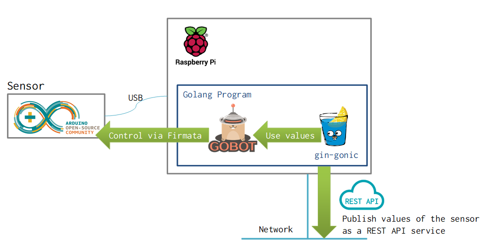

# IoT API Sample

## 概要

これは、以下の特徴をもったシステムのモック実装です。

* Arduinoに接続したセンサーを[Gobotライブラリ](https://gobot.io/documentation/platforms/arduino/)を用いて読み取る
* [gin-gonicライブラリ](https://github.com/gin-gonic/gin)を用いたREST APIサービスを作る
* センサー読み取り値をREST APIで公開する（JSON over HTTP）

## 各ディレクトリの説明

* api
  * gin-gonicを使ったAPIサービスのサンプル
* sample-files
  * `sensor-api`に関連したJSONデータのサンプル
* sensor
  * gobotを使ってArduinoのセンサー値を読み取るサンプル
* sensor-api
  * gobotでのセンサー読み取り値を、gin-gonicのAPIサービスと組み合わせたサンプル
* temp-sensor
  * Arduinoの`A0`に温度センサー`LM35DZ`をつけて温度を読み取るサンプル
